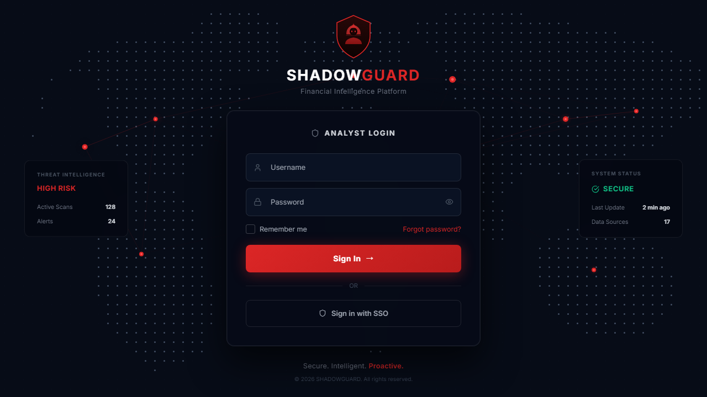
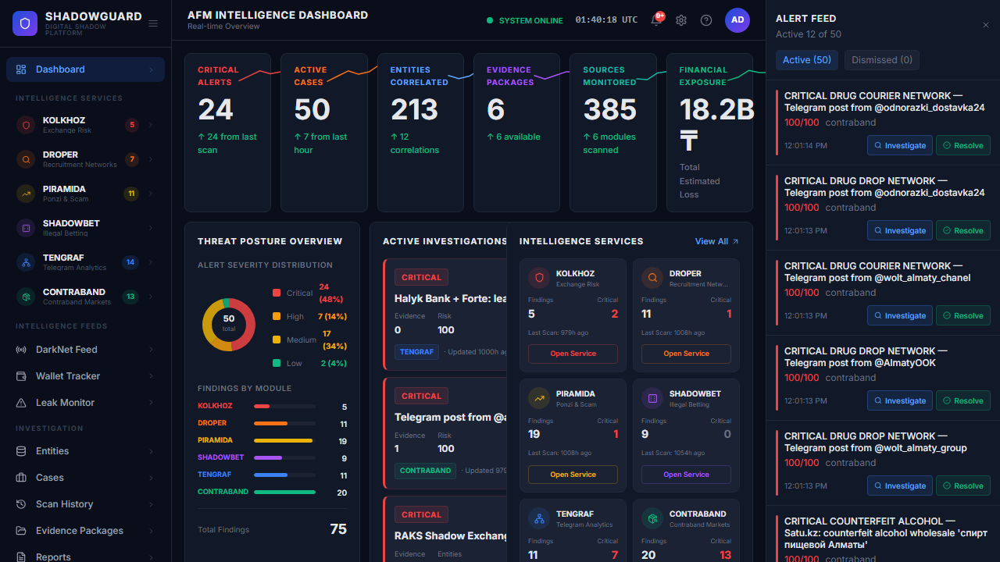
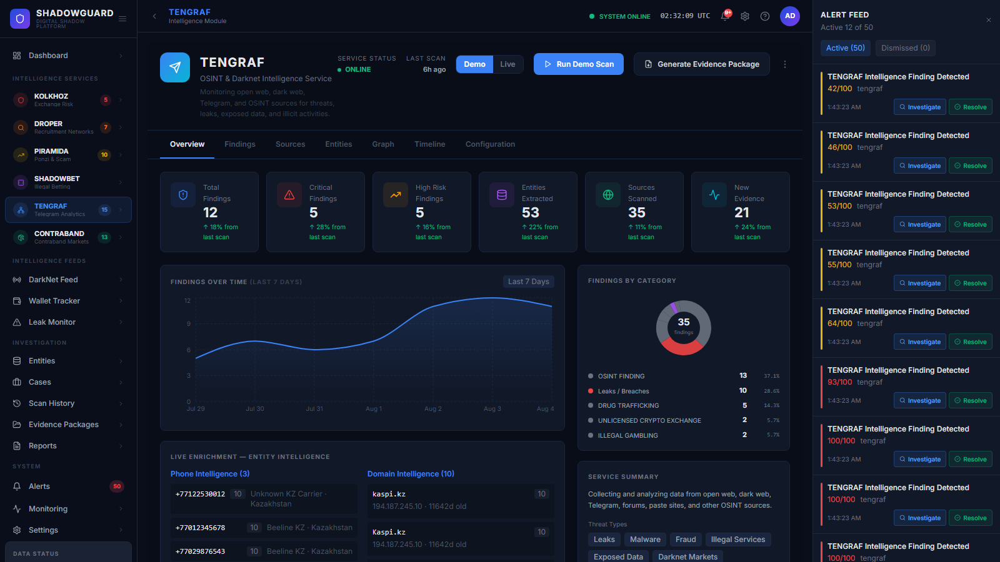
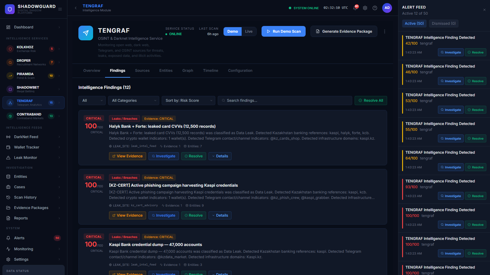
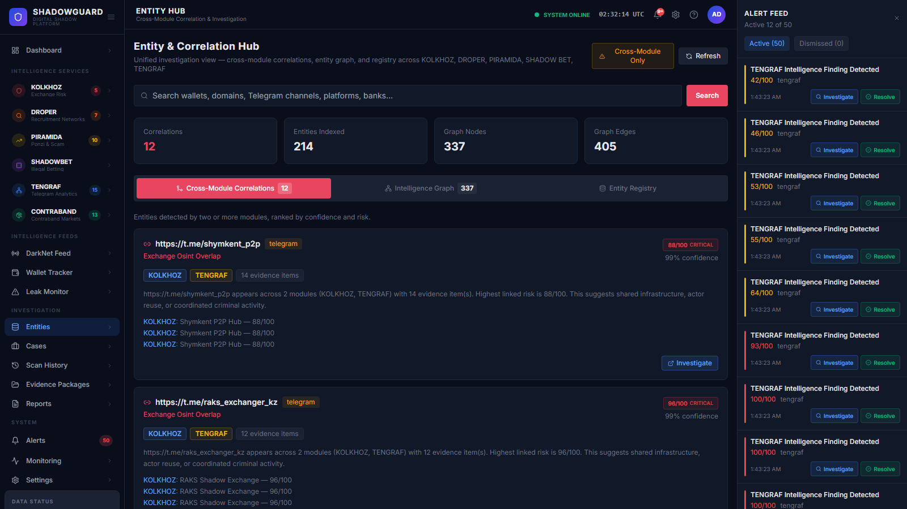
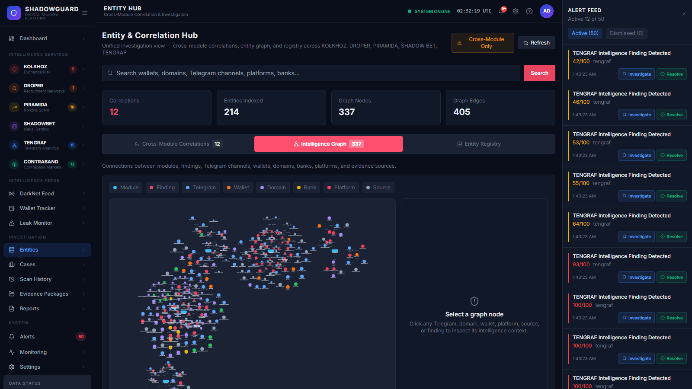
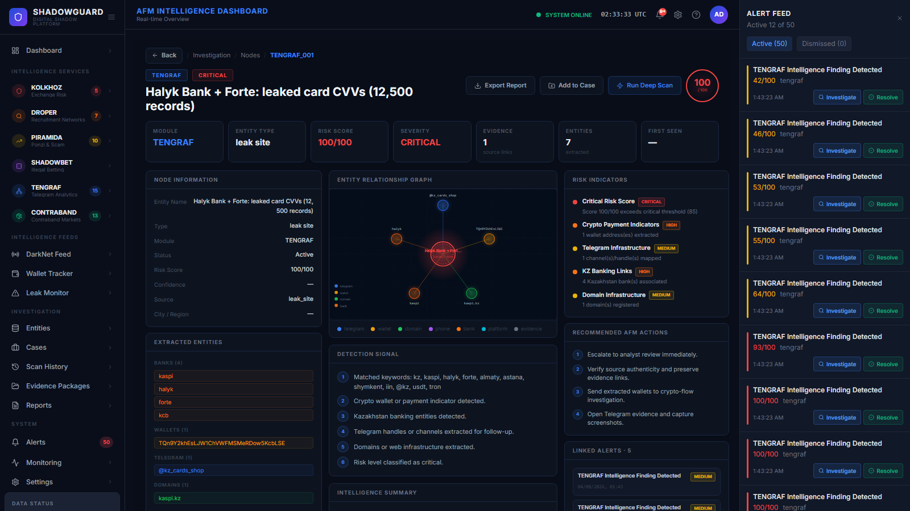
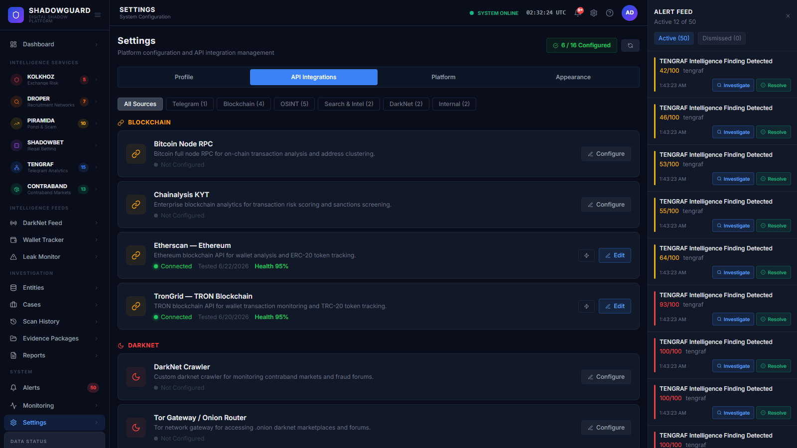

# ShadowGuard Intelligence Platform

### AFM AI Hackathon 2026 — Track 1: Digital Shadow

**ShadowGuard** is a unified OSINT, DarkNet, and financial-flow monitoring platform built for Kazakhstan's **Agency for Financial Monitoring (AFM)**. It ingests signals from Telegram, the open web, DarkNet/Tor, blockchain (TRON/ETH), and public registries to detect and investigate six categories of financial crime: shadow-exchange collapses, drop-card recruitment networks, financial pyramid schemes, illegal gambling operations, general DarkNet/OSINT threats, and contraband trafficking.

This document is a complete technical reference for the codebase as it exists on disk — architecture, every module's internals, every API endpoint, every database table, every config toggle, how to run it locally, and a candid list of the gaps between what the code *appears* to promise and what it actually does today.

> **Read this if:** you're onboarding onto the codebase, extending a module, debugging the platform locally, or preparing a demo. Sections are self-contained — jump to what you need via the table of contents.

---

## Table of Contents

1. [Overview](#overview)
2. [Screenshots](#screenshots)
3. [Architecture](#architecture)
4. [Tech Stack](#tech-stack)
5. [Intelligence Modules — Deep Dive](#intelligence-modules--deep-dive)
   - [KOLKHOZ](#1-kolkhoz--shadow-exchange-pre-collapse-signal-engine)
   - [DROPER (ДРОПЕР)](#2-droper-дропер--drop-card-recruitment-network-graph-intelligence)
   - [PIRAMIDA (ПИРАМИДА)](#3-piramida-пирамида--financial-pyramid-early-warning-system)
   - [SHADOWBET (ŞADOW BET)](#4-shadowbet-şadow-bet--illegal-gambling-financial-flow-tracker)
   - [TENGRAF (ТЕНЬGRAF)](#5-tengraf-теньgraf--darknet--open-web-intelligence-module)
   - [CONTRABAND-KZ](#6-contraband-contraband-kz--drugsvapealcoholcourier-osint-module)
6. [Backend Architecture](#backend-architecture)
7. [ML / Threat Classifier](#ml--threat-classifier)
8. [Frontend Architecture](#frontend-architecture)
9. [Database Schema](#database-schema)
10. [API Reference](#api-reference)
11. [Infrastructure & Deployment](#infrastructure--deployment)
12. [Getting Started — Run It Locally](#getting-started--run-it-locally)
13. [Environment Variables](#environment-variables)
14. [Default Credentials & Security Notes](#default-credentials--security-notes)
15. [Known Issues & Architectural Gaps](#known-issues--architectural-gaps)
16. [Project Structure](#project-structure)
17. [Legal & Compliance](#legal--compliance)

---

## Overview

| | |
|---|---|
| **Real-world basis** | Modeled on actual AFM cases: RAKS Exchange collapse ($224M laundered), Amir Capital Ponzi scheme ($10M seized), 20,000 frozen drop cards, 1,100+ blocked gambling sites |
| **Audience** | AFM analysts investigating financial crime across digital channels |
| **Operating modes** | **Live** (real scraping/enrichment via Celery), **Demo** (rich hardcoded fixture data for showcasing), **Playback** (historical case replay for KOLKHOZ/PIRAMIDA) |
| **Primary UI metaphor** | A dark "SOC" (Security Operations Center) dashboard — KPIs, alert feed, cross-module entity graph, per-module investigation panels |

---

## Screenshots

> Screenshots below were captured live from a locally running instance (see [Getting Started](#getting-started--run-it-locally)). Source files live under `docs/screenshots/`.

### Login


### Main Dashboard (AFM Intelligence Dashboard)


### Module Overview — e.g. TENGRAF


### Module Findings Tab


### Entities Page — Cross-Module Correlations


### Entities Page — Intelligence Graph (Cytoscape)


### Investigation Console


### Settings — API Integrations


---

## Architecture

```
                                 ┌────────────────────────┐
                                 │   nginx (port 80)      │
                                 │  reverse proxy + TLS    │
                                 └───────────┬─────────────┘
                        ┌────────────────────┼────────────────────┐
                        ▼                                         ▼
          ┌──────────────────────────┐                ┌─────────────────────────┐
          │  Frontend — React 18 SOC  │                │  Backend — FastAPI       │
          │  dashboard (port 3000)    │◄──REST + WS────┤  (port 8000)             │
          └──────────────────────────┘                └────────────┬─────────────┘
                                                                     │
                     ┌───────────────────────┬────────────────────┼─────────────────┬───────────────────┐
                     ▼                       ▼                    ▼                 ▼                   ▼
           ┌──────────────────┐   ┌───────────────────┐  ┌──────────────┐  ┌───────────────┐  ┌──────────────────┐
           │ Celery workers     │   │ PostgreSQL 16      │  │ Redis 7      │  │ Elasticsearch 8│  │ MinIO             │
           │ 6 module queues +  │   │ (persistent data)  │  │ cache + queue│  │ (logs/search)  │  │ (evidence/reports)│
           │ celery-beat        │   └───────────────────┘  └──────────────┘  └───────────────┘  └──────────────────┘
           └─────────┬──────────┘
                     │
    ┌────────────────┼──────────────────────────────────────────────────────────────────┐
    ▼                ▼                ▼                ▼                ▼                ▼
 KOLKHOZ          DROPER          PIRAMIDA         SHADOWBET         TENGRAF         CONTRABAND
 (exchange        (drop-card      (pyramid         (illegal          (darknet/       (drugs/vape/
  collapse)        networks)       schemes)         gambling)         OSINT)         alcohol/courier)
    │                │                │                │                │                │
    └──── Telegram (Telethon) · Open Web · DarkNet/Tor · TRON/ETH blockchain · Registries (AIFC/eGov) ────┘
```

**Request flow (live scan):** Frontend `POST /api/v1/modules/{id}/run` → backend creates a `ModuleTask` row → dispatches a Celery task onto that module's dedicated queue → worker scrapes/enriches/scores → writes `result_data` back to `ModuleTask` and fires `Alert` rows for high-risk findings → frontend polls `GET /api/v1/modules/{id}/tasks/{task_id}` every 2s → on completion, re-fetches `/alerts/`. Real-time alert *pushes* (not scan results) are also broadcast over `WS /ws/alerts` to every connected client.

---

## Tech Stack

**Backend:** Python 3.11 · FastAPI 0.110 · SQLAlchemy 2.0 (async, asyncpg) · Alembic · Celery 5.4 · Redis 7 · PostgreSQL 16 · Elasticsearch 8 · MinIO · Telethon (Telegram MTProto) · spaCy + Transformers + PyTorch + scikit-learn (NLP/ML) · NetworkX + python-louvain (graph analytics) · WeasyPrint (PDF) · python-jose + passlib[bcrypt] (JWT auth)

**Frontend:** React 18 + TypeScript · Vite 5 · React Router v6 · Zustand 4 (state) · TanStack React Query (installed, minimally used) · Axios · Cytoscape.js (graph viz) · Recharts (charts) · Tailwind CSS · lucide-react (icons)

**Infrastructure:** Docker + Docker Compose · nginx · Kubernetes manifests (partial) · Grafana (dashboards, provisioned) · PostgreSQL 16 · Redis 7 · Elasticsearch 8 · MinIO

---

## Intelligence Modules — Deep Dive

All six modules implement the same [`BaseModule`](#module-contract--basemodule) abstract contract, run as Celery tasks on dedicated queues, and follow the same lifecycle: **scrape → extract entities → score risk → cross-module correlate → create alerts → persist result**. Each module's `config.py` (or, for CONTRABAND, `module.py::DEFAULT_CONFIG`) controls seed sources, keyword lists, and thresholds.

| Module | Queue | Periodic scan | Real-world case modeled |
|---|---|---|---|
| KOLKHOZ | `kolkhoz` | hourly | RAKS Exchange collapse (Sept 2025) |
| DROPER | `droper` | every 2h | 20,000 frozen drop cards |
| PIRAMIDA | `piramida` | hourly | Amir Capital Ponzi scheme ($10M seized) |
| SHADOWBET | `shadowbet` | every 2h | 1,100+ blocked illegal gambling sites |
| TENGRAF | `tengraf` | every 2h | General DarkNet/OSINT sweep |
| CONTRABAND | `contraband` | every 2h | Drugs/vape/alcohol/courier trafficking |

---

### 1. KOLKHOZ — Shadow Exchange Pre-Collapse Signal Engine

> "Pre-collapse shadow exchange signal engine. Monitors darknet forums, Telegram channels, and blockchain flows for early warning signals of shadow crypto exchange collapse — tuned for the CIS criminal ecosystem."

Detects unlicensed P2P/OTC crypto exchanges ("obmenniks") heading toward an exit scam or collapse, based on complaint surges, support-channel silence, wallet outflow anomalies, and domain downtime.

**Directory layout** (`backend/app/modules/kolkhoz/`)
```
blockchain/    wallet_monitor.py (USDT balance + 7-day flow via TRON), flow_analyzer.py (outflow velocity)
nlp/           complaint_classifier.py, sentiment_analyzer.py (hourly complaint-rate trend), entity_extractor.py, vocabulary.py
scrapers/      telegram_scraper.py, domain_monitor.py (HTTP status), bot_monitor.py (support-bot silence), forum_scraper.py (Ahmia darknet search)
scoring/       risk_engine.py, signal_weights.py, alert_dispatcher.py
playback/      raks_dataset.py (RAKS_TIMELINE), timeline_builder.py (lead-time metric)
reporting/     evidence_builder.py (cites AML Law No. 88-V)
```

**Scoring** — weighted sum of 5 signals (`scoring/signal_weights.py`), each 0–100, capped at 100:

| Signal | Weight | Computed from |
|---|---|---|
| `complaint_surge` | 0.30 | `min(complaint_rate × trend_multiplier, 100)` — multiplier 120 (spike) / 90 (increasing) / 60 (stable) |
| `support_silence` | 0.25 | `min(hours_since_last_message × 8, 100)` if channel is silent |
| `wallet_outflow_drop` | 0.25 | `signal_strength × 100` — flagged when 7-day outflow > 3× inflow and > 1,000 USDT |
| `domain_downtime` | 0.10 | 100 if exchange domain is offline/timeout/error |
| `social_deletion` | 0.10 | always 0 — marked `manual_check_required`, not automated |

Risk levels: **critical ≥ 85**, **high ≥ 65**, **medium ≥ 40**, else low. `alert_fired = score ≥ 65`. The module also derives `collapse_probability` (85–98% at score ≥ 85), `health_status` (`COLLAPSE RISK` / `CRITICAL WARNING` / `WATCHLIST` / `HEALTHY`), and `exchange_category`.

**Historical playback — RAKS Exchange:** `playback/raks_dataset.py::RAKS_TIMELINE` replays 9 real events from Sept 27–30, 2025 — complaint surge → support delay → wallet outflow anomaly → **system alert threshold reached (score 71) 14 hours before actual AFM action** → support goes silent → domain 503s → score 91 CRITICAL → **AFM freezes 67 wallets, seizes 9.7M USDT**. `timeline_builder.py` computes the `hours_lead_time` metric that demonstrates the system's predictive value.

**Config** (`config.py`): `alert_threshold_high=85`, `alert_threshold_medium=65`, `scan_interval_seconds=3600`, `max_messages_per_channel=200`, `complaint_lookback_hours=48`, `wallet_lookback_days=7`. `WATCHED_EXCHANGES` includes RAKS Exchange (historical/playback) and ShadowFX (active); `module.py` merges in 6 more via `SUPPLEMENTAL_EXCHANGES` (KaspEx OTC, NomadSwap, AltynCoin Exchange, FastChange Market, CryptoBridge KZ).

**Data sources:** Telegram (channel + support-bot monitoring), domain HTTP monitoring, TRON blockchain wallet monitoring, Ahmia darknet forum search.

---

### 2. DROPER (ДРОПЕР) — Drop-Card Recruitment Network Graph Intelligence

> "Drop card recruitment network graph intelligence. Maps Telegram-based drop card recruitment ecosystems using NLP and graph analysis to identify criminal networks before cards are activated."

Targets Telegram channels recruiting money mules ("дропы") to rent/sell bank cards (Kaspi/Halyk/Forte/etc.) for laundering, then graphs the recruiter → card → cash-out wallet chain.

**Directory layout** (`backend/app/modules/droper/`)
```
nlp/           vocabulary.py (28 recruitment keywords), entity_extractor.py, recruitment_classifier.py
scrapers/      telegram_scraper.py, channel_searcher.py, vk_scraper.py (stub — needs VK API token)
enrichment/    bank_identifier.py (BANK_REGISTRY w/ BIC codes), phone_enricher.py, cashout_tracker.py, cross_module_linker.py
graph/         graph_builder.py, community_detector.py (Louvain), centrality_analyzer.py, edge_builder.py, graph_exporter.py
scoring/       channel_scorer.py, network_ranker.py, alert_dispatcher.py
reporting/     evidence_builder.py
```

**Scoring** (`scoring/channel_scorer.py`, additive, capped at 100):
```
+55 (≥20 recruitment posts) / +45 (≥10) / +30 (≥5) / +10 (≥1)
+20 (≥5,000 members) / +15 (≥1,000) / +8 (≥200)
+min(banks_mentioned × 5, 20)
+min(phones_extracted × 3, 15)
+15 if an average payout figure is present
```
Community-level threat score (`network_ranker.py`): `avg_risk_score×0.5 + min(total_posts/10, 30)×0.3 + channel_count×2×0.2`.

**Graph analysis:** `graph_builder.py` builds a NetworkX graph — edges are `shared_admin` (shared Telegram handles, weight ×2.0), `shared_contact` (shared phone numbers, ×1.5), `shared_infrastructure` (≥2 shared banks, ×0.5). `community_detector.py` runs Louvain community detection (falls back to connected components). `centrality_analyzer.py` combines degree (0.6) + betweenness (0.4) centrality to rank key recruiters.

**Cash-out chain intelligence** (`enrichment/cashout_tracker.py`) — the module's most sophisticated file: regex-extracts card numbers, TRON/ETH/BTC wallets, phones, and payout percentages, then builds a recruiter→card→wallet chain per channel with its own additive risk score (base 30 + card data +25 + wallet data +20 + Kaspi reference +15 + recruitment post +15 + payout % +10). Always supplements live results with **2 hardcoded "active cashout chain" records** attributed to "KZ SNB/AFM operational bulletins" (a 47-card Almaty Kaspi network, risk 88 critical; a 23-card Halyk Astana network, risk 76 high).

**Config** (`config.py`): `SEED_CHANNELS = [forcedropofficial, easydropz, Dropershoper]`, `min_recruitment_posts_for_alert=5`, `high_risk_channel_threshold=70`, `scan_interval_seconds=7200`. `BANK_NAMES` covers Kaspi/Halyk/Forte/Jusan/Bereke/CenterCredit/Sberbank/Tinkoff (EN+RU).

**Data sources:** Telegram (primary), VK (stub, not implemented).

**Note:** No dedicated historical case dataset — the hardcoded cashout-chain intel in `cashout_tracker.py` substitutes for one.

---

### 3. PIRAMIDA (ПИРАМИДА) — Financial Pyramid Early Warning System

> "Financial pyramid early warning system. Detects pyramid schemes on Kazakh and Russian social platforms using NLP return-rate extraction, registry validation, and on-chain analysis."

Models the real **Amir Capital** case (AFM Almaty seized $10M, 40+ arrested).

**Directory layout** (`backend/app/modules/piramida/`)
```
nlp/           vocabulary.py, investment_classifier.py, return_extractor.py (normalizes to monthly-equivalent %), referral_detector.py, urgency_detector.py
validation/    license_validator.py, aifc_registry_checker.py (AFSA/AIFC), egov_registry_checker.py (KZ company registry), kg_registry_checker.py (stub — Kyrgyzstan)
blockchain/    inflow_analyzer.py (many-small-inflows Ponzi signature), wallet_extractor.py, wallet_age_checker.py, tron_client.py
enrichment/    victim_estimator.py, geo_tagger.py (cross-border detection)
cases/         amir_capital_dataset.py (AMIR_CAPITAL_TIMELINE), case_matcher.py (fuzzy match against KNOWN_CASE_PATTERNS)
scrapers/      telegram_scraper.py, channel_searcher.py, instagram_scraper.py (stub), website_scraper.py
scoring/       pyramid_scorer.py + scoring/components/{return,registration,blockchain,referral,velocity}_score.py, alert_dispatcher.py
reporting/     evidence_builder.py (cites Article 217 of the KZ Criminal Code)
```

**Scoring** — weighted sum, `PYRAMID_SIGNAL_WEIGHTS`:

| Signal | Weight | Logic |
|---|---|---|
| `return_promise` | 0.30 | 100 (≥20%/mo) / 90 (≥10%) / 75 (≥5%) / 55 (≥3%) / 20 (≥1%) / 0 |
| `registration_validity` | 0.25 | `100 - validity_score` (unregistered = high risk; AIFC-registered → 0) |
| `blockchain_activity` | 0.20 | inflow-size tiers + "many small inflows" Ponzi pattern (+30) + suspicious flag (+20) |
| `referral_structure` | 0.15 | +50 has referral program, +40 multilevel, + confidence×10 |
| `recruitment_velocity` | 0.10 | `weekly_growth / member_count` ratio tiers |

Levels: **critical ≥ 85**, **high ≥ 70**, **medium ≥ 50**, else low. `alert_fired = score ≥ 70`.

**Historical playback — Amir Capital:** `cases/amir_capital_dataset.py::AMIR_CAPITAL_TIMELINE` — 6 events (Jan–Sep 2025): channel launch → 10%/mo return promise extracted → referral/MLM detected → **system alert at score 71 (4,200 members, ~1,400 estimated victims)** → cross-border expansion to KG/BY/RU → **AFM action: $10M seized, lead organizer arrested, 15,000 members, ~5,000 estimated victims, 480M KZT**.

**Victim/funds-at-risk modeling** (`enrichment/victim_estimator.py`): `estimated_victims = max(member_count × 0.15, inflow_usdt / $200)`; `estimated_funds_kzt = estimated_funds_usd × 450 KZT/USD`.

**Config** (`config.py`): `high_risk_score_threshold=70`, `critical_score_threshold=85`, `min_return_rate_flag=3.0%`, `critical_return_rate=10.0%`, `scan_interval_seconds=3600`. Seed channels: `crypto_invest_kz`, `time_to_invest_channel`, `zarabotok_kz`, `forex_kz`.

**Data sources:** Telegram (primary), Instagram (stub), open web (landing-page scraping), TRON blockchain, AIFC/AFSA registry, KZ eGov registry, Kyrgyzstan MoJ registry (stub).

---

### 4. SHADOWBET (ŞADOW BET) — Illegal Gambling Financial Flow Tracker

> "Illegal gambling financial flow tracker. Maps unlicensed betting platforms, influencer promotion networks, and shared operator infrastructure across Kazakh and Russian social platforms."

Targets unlicensed bookmakers/casinos (1xBet, Mostbet, Melbet, 1win, Pin-Up, etc.) lacking AIFC/BAC licenses, the influencer networks promoting them, and shared payment/domain infrastructure.

**Directory layout** (`backend/app/modules/shadowbet/`)
```
clustering/    domain_clusterer.py (WHOIS registrar+NS fingerprint), operator_resolver.py, design_fingerprinter.py (CSS-class MD5 hash for cloned sites), ip_analyzer.py (/24 grouping)
influencer/    account_profiler.py (tier: mega/macro/micro/nano), affiliate_mapper.py, network_builder.py, reach_calculator.py
validation/    aifc_license_checker.py, bac_registry_checker.py (Betting Account Center), ssl_inspector.py, whois_lookup.py
blockchain/    deposit_wallet_extractor.py, payment_flow_analyzer.py, wallet_linker.py (shared-wallet detection across operators)
enrichment/    mobile_payment_tracker.py (KZ telecoms), payment_method_extractor.py (regulatory-risk tagging)
scrapers/      telegram_scraper.py, affiliate_scraper.py, domain_extractor.py, channel_searcher.py, instagram_scraper.py (stub), tiktok_scraper.py (stub)
scoring/       platform_scorer.py, operator_scorer.py, influencer_scorer.py, alert_dispatcher.py
reporting/     evidence_builder.py (Article 307 KZ Criminal Code + AFM mobile-payment directive), blocking_request_generator.py
```

**Scoring** — three separate scorers:
- **Platform** (`PLATFORM_SIGNAL_WEIGHTS`: license 0.35, domain clustering 0.25, payment methods 0.20, influencer reach 0.20). Levels critical ≥ 85 / high ≥ 70 / medium ≥ 50. `alert_fired = score ≥ 40`.
- **Operator network** (additive): `min(domains×15,40) + min(influencers×10,30) + min(wallets×10,30)`; also estimates `weekly_revenue_kzt`.
- **Influencer liability**: `min(member/10000×30,30) + min(posts×3,30) + min(platforms×10,25) + min(codes×5,15)`.

**Regulatory outputs:** `reporting/blocking_request_generator.py::generate_blocking_request()` produces a formal, submittable **AFM Domain Blocking Request** naming the target ministry (Ministry of Culture and Information of Kazakhstan) and legal basis.

**Config** (`config.py`): `GAMBLING_SEED_CHANNELS = [mostbet_kz, betwinner_kz, stavki_kz, casino_kz]`, `ILLEGAL_PLATFORM_NAMES` (1xbet, melbet, mostbet, 1win, pin-up, betwinner, 22bet, betway, parimatch), `high_risk_score_threshold=70`, `critical_score_threshold=85`.

**Data sources:** Telegram (primary), Instagram (stub), TikTok (stub), WHOIS/SSL/IP intel, TRON blockchain, AIFC + BAC registries.

**Note:** No dedicated historical case dataset — relies on live/demo Telegram scraping.

---

### 5. TENGRAF (ТЕНЬGRAF) — DarkNet & Open-Web Intelligence Module

> "DarkNet and open-web intelligence module. Monitors fraud forums, leak boards, marketplace-style sources, and suspicious public intelligence feeds for Kazakhstan-linked financial crime indicators."

The platform's broad OSINT sweep — pulls from Telegram, Reddit, GitHub, paste sites, search engines, and Tor `.onion` nodes, classifying findings into `DATA_LEAK`, `DROPPER_NETWORK`, `ILLEGAL_BETTING`, `PYRAMID_SCHEME`, or `CRYPTO_FINANCIAL_CRIME`. Unlike the other five modules it has **no dedicated `nlp/`, `blockchain/`, `graph/`, or `reporting/` subfolders** — just `extractors/`, `scrapers/`, `scoring/`.

**Directory layout** (`backend/app/modules/tengraf/`)
```
extractors/    entity_extractor.py (domains, KZ phones, handles, wallets, bank/platform keywords)
scrapers/      darknet_feed.py (central 7-source aggregator), leak_detector.py, github_osint.py, reddit_osint.py, telegram_osint.py
scoring/       threat_scorer.py (most elaborate scoring fn in the codebase)
```

`scrapers/darknet_feed.py::DarknetFeed.collect()` fans out to 7 source types every scan: paste sites → open web (KZ gov/regulator URLs) → Telegram → Reddit → GitHub → search engine → Tor `.onion` (only if `ONION_SEED_URLS` configured).

**Leak detection** (`scrapers/leak_detector.py`): combines GitHub code-search (`GITHUB_LEAK_QUERIES` like `"kaspi password kz"`, `"KASPI_API_KEY"`), paste-site scanning, and **4 hardcoded "confirmed active leak campaigns"** attributed to "KZ-CERT advisories, AFSA bulletins" — a Kaspi-phishing campaign (23,000 victims, risk 91), a stolen-investor-PII sale (156,000 records, risk 87), exposed Kaspi payment-gateway API keys on GitHub (risk 82), and an underground-forum "egov.kz employee access" listing (risk 97).

**Scoring** (`scoring/threat_scorer.py`) — additive, with both boosts *and* noise penalties:
- Base by source type: marketplace/leak_site +25, forum +15, telegram +8, public_web +3, github +0.
- Entity risk: wallets +≤35, telegram handles +≤18, banks +≤35, phones +≤20, domains +≤15, platforms +≤25.
- Combined-indicator bonuses (e.g. wallet+telegram +20, bank+wallet +25).
- High-confidence phrases (bank logs, fullz, carding, обнал, дроп карта, crypto mixer, trc20…): `+min(hits×14, 45)`.
- **Noise penalties**: gaming terms (cs2, skin, awp) −45/−30/−15, sports terms −35/−20, zero-signal GitHub repos −40, generic "drop" without financial context −25, regulator public-web pages capped at 18.

Levels: critical ≥ 85 / high ≥ 70 / medium ≥ 40. `alert_fired = score ≥ 40`.

**Post-processing filter** (`tasks.py::clean_and_rank_findings()`): `MIN_VISIBLE_RISK=25`, `MIN_ALERT_RISK=40`, `MAX_FINDINGS=20` — aggressively hides low-value GitHub/public-web/gaming noise unless real financial-crime entities are present, then sorts by `(risk_score, has_wallets, has_banks)` and truncates to top 20.

**Config** (`config.py` — the largest config file in the codebase, ~90 keywords spanning KZ core terms, identity/credential leaks, KZ phone prefixes, card/payment fraud, dropper networks, crypto, illegal betting, investment scams, contraband, and darknet/OSINT terms). `ONION_SEED_URLS` lists 5 legitimate .onion nodes (Tor Project, DuckDuckGo, ProPublica, SecureDrop, Riseup) requiring a local Tor SOCKS proxy at `127.0.0.1:9050`.

**Data sources:** paste sites, open web (KZ-CERT/AFSA/gov.kz/National Bank/Interpol), Telegram, Reddit, GitHub, search engine, Tor `.onion`.

**Note:** No dedicated historical case dataset — the 4 hardcoded leak campaigns in `leak_detector.py` substitute for one.

---

### 6. CONTRABAND (CONTRABAND-KZ) — Drugs/Vape/Alcohol/Courier OSINT Module

> "Drugs, vapes, alcohol, courier/drop-network, and contraband OSINT/DarkNet intelligence module for Kazakhstan."

Structurally the most different module: no `config.py` (defaults live inline in `module.py::DEFAULT_CONFIG`), Pydantic-modeled findings (`schemas.py::ContrabandFinding`), and orchestration delegated to a standalone `service.py::run_contraband_intelligence()`.

**Directory layout** (`backend/app/modules/contraband/`)
```
analyzers/     drug_analyzer.py, vape_analyzer.py, alcohol_analyzer.py, courier_analyzer.py, contraband_classifier.py (fan-out + dedup + sort)
collectors/    telegram_collector.py, web_collector.py, darknet_collector.py (real Tor/SOCKS5 crawler), instagram_collector.py, marketplace_collector.py, source_registry.py
data/          drug_keywords.json (63), vape_keywords.json (59), alcohol_keywords.json (54), courier_keywords.json (39), kazakhstan_locations.json (20 cities + 14 regions)
playback/      drug_case.py, vape_case.py, alcohol_case.py —  defined but **not wired into any code path**
reporting/     evidence_report.py
(top level)    entity_extractor.py, risk_scoring.py, graph_builder.py, evidence_builder.py, utils/
```

**Category classification** — each analyzer looks at keyword co-occurrence, e.g. `drug_analyzer.py::classify_drug_category()`: vendor+courier terms → `drug_courier_network`; vendor+drop terms → `drug_drop_network`; else `drug_vendor`. Drug terms include "закладка" (dead-drop), "клад", "кладмен", "меф", "alpha-pvp". Vape brands tracked: ElfBar, HQD, Lost Mary, Vozol, Waka.

**Marketplace collection** (`collectors/marketplace_collector.py`) — the most elaborate collector: scrapes **real Kazakhstan marketplaces** (OLX Kazakhstan, Kaspi Marketplace, Avito KZ, Satu.kz) across 4 query categories, scores each listing (base 20 + category bonuses), and supplements with **4 hardcoded "verified" findings** from "KZ Customs/AFSA bulletins" (ElfBar seizure at Khorgos border crossing, coded-language drug listing on Avito, counterfeit alcohol on Satu.kz, drop-courier job posting on OLX).

**Scoring** (`risk_scoring.py::calculate_risk_score()`, additive, base 5):
```
category:  HIGH_RISK (drug_vendor/drop/courier, contraband_marketplace) = +35;  MEDIUM_RISK (vape/alcohol smuggling variants) = +22;  else +10
source:    darknet +25, marketplace +18, telegram +15, forum +12, instagram +8, public_web +6
entities:  telegram +10, phone +12, wallet +15, domain +7, location +10, substances +18, brands +8, prices +6
text:      drug terms +25, courier +18, vape +16, alcohol +16, wholesale +6, delivery +6, KZ-city mention +6
```
Levels: critical ≥ 85 / high ≥ 70 / medium ≥ 40. `alert_fired = score ≥ 40`. (`courier_analyzer.py` applies an additional +≤18 re-boost for courier/drop/recruitment term density.)

** Orphaned playback data:** `playback/drug_case.py`, `vape_case.py`, and `alcohol_case.py` define static historical-style cases ("Almaty Synthetic Drug Network", "Kazakhstan Illegal Vape Distribution", "Illegal Alcohol Distribution Network") but **no code path calls them** — `service.py::build_demo_sources()` is what demo mode actually uses instead (8 fictional-but-realistic sources scored live through the same pipeline as production data).

**Config** — no `config.py`; defaults are `module.py::ContrabandModule.DEFAULT_CONFIG`: `include_telegram/web/darknet/instagram=True`, `max_items=20`, `max_findings=20`, `max_channels=20`. Collector-specific env vars: `CONTRABAND_WEB_URLS`, `CONTRABAND_WEB_KEYWORDS`, `CONTRABAND_DARKNET_URLS`, `CONTRABAND_INSTAGRAM_URLS`, `TOR_PROXY` (default `socks5h://127.0.0.1:9050`).

**Data sources:** Telegram, open web (env-configured), DarkNet/Tor (SOCKS5), Instagram (public profiles, no auth), 5 real KZ marketplaces.

---

## Backend Architecture

### App Bootstrap (`backend/app/main.py`)

```python
app = FastAPI(
    title="ShadowGuard", version="1.0.0",
    docs_url="/api/docs" if APP_ENV == "development" else None,  # ReDoc always disabled
    lifespan=lifespan,
)
```

- **Lifespan**: on startup, runs `Base.metadata.create_all` against the async engine — **tables are created directly from SQLAlchemy models at boot**, independent of the Alembic migration chain. On shutdown, disposes the engine.
- **Middleware actually registered**: only `CORSMiddleware` (`allow_origins=settings.ALLOWED_ORIGINS`, credentials + all methods/headers). See [Known Issues](#known-issues--architectural-gaps) — the dedicated `app/middleware/*.py` files are **not wired in**.
- **Exception handlers**: custom handlers for `HTTPException` (`{"error", "status_code"}`) and any unhandled `Exception` (masks details, returns generic 500).
- **Routers**: `api_router` (prefix `/api/v1`) and `ws_router` (mounts `/ws/alerts`, no prefix).
- `GET /health` → `{"status": "ok", "version": "1.0.0"}` — top-level, outside `/api/v1`.

### Configuration (`backend/app/core/config.py`)

Pydantic `Settings(BaseSettings)`, loaded from `.env`, `case_sensitive=True`, `extra="ignore"`. See the full [Environment Variables](#environment-variables) table below. Two computed properties assemble the Postgres connection string:
```python
DATABASE_URL      = "postgresql+asyncpg://{user}:{password}@{host}:{port}/{db}"   # used by the app (async)
SYNC_DATABASE_URL = "postgresql://{user}:{password}@{host}:{port}/{db}"           # used by Alembic
```
Module enable/disable toggles (`KOLKHOZ_ENABLED`, `DROPER_ENABLED`, etc.) are declared but **not enforced** — `module_dispatcher.py`'s registry unconditionally instantiates all 6 modules regardless of these flags.

### Database (`backend/app/core/database.py`)

`create_async_engine(DATABASE_URL, pool_pre_ping=True, pool_size=10, max_overflow=20)`, `AsyncSessionLocal` session factory, shared `Base(DeclarativeBase)`. `get_db()` is the standard FastAPI dependency: yields a session, commits on success, rolls back and re-raises on exception, always closes.

### Auth & Security (`backend/app/core/security.py`)

- Passwords: bcrypt via `passlib.CryptContext`.
- JWT: `python-jose`, algorithm **HS256**, signed with `SECRET_KEY`.
  - Access token: `{"sub", "exp": now+ACCESS_TOKEN_EXPIRE_MINUTES(15), "type": "access", "role", "username"}`
  - Refresh token: `{"sub", "exp": now+REFRESH_TOKEN_EXPIRE_DAYS(7), "type": "refresh"}`
- No server-side token revocation/blacklist — logout is a stateless client-side no-op.

### Celery & Task Queues (`backend/app/core/celery_app.py`)

```python
celery_app = Celery("shadowguard", broker=CELERY_BROKER_URL, backend=CELERY_RESULT_BACKEND)
task_serializer="json", timezone="Asia/Almaty", task_acks_late=True, worker_prefetch_multiplier=1
```
One queue per module (`task_routes`), with `celery_app.send_task(f"app.modules.{module_id}.tasks.run_analysis", queue=module_id)` used by the `/modules/{id}/run` endpoint. `beat_schedule` fires each module's `periodic_*_scan` task on its documented interval (see the [module table](#intelligence-modules--deep-dive) above).

### Middleware (`backend/app/middleware/*.py`) —  present but unused

None of these are registered via `app.add_middleware`/`app.middleware("http")` in `main.py` — they exist as standalone functions but never execute:
- `audit_middleware.py` — logs `METHOD path -> status` (would-be global audit log; the *actual* audit trail is written ad hoc by `AuditService.log()`, only from the `modules.py` run endpoints).
- `auth_middleware.py` — imports `decode_token` but the body is a pure pass-through; real auth is enforced per-route via `deps.get_current_user`.
- `cors.py::setup_cors()` — duplicates what `main.py` already does inline.
- `rate_limit.py` — a real in-memory sliding-window limiter (100 req / 60s per client IP) that is simply never applied.
- `rbac_middleware.py` — pass-through stub; real RBAC is enforced via `deps.require_role/_admin/_analyst/_auditor`.

### Dependency Injection (`backend/app/api/deps.py`)

- `get_current_user` — decodes the bearer token, rejects non-`access`-type tokens, loads the `User`, rejects if inactive.
- `require_role(*roles)` factory → `require_admin`, `require_analyst` (admin+analyst), `require_auditor` (admin+analyst+auditor). No `require_readonly` — the `readonly` role only ever gets plain-`get_current_user`-level access.

### Module Contract — `BaseModule`

```python
class BaseModule(ABC):
    module_id: str
    module_name: str
    module_version: str
    module_description: str

    @abstractmethod
    def validate_input(self, data: dict) -> bool: ...
    @abstractmethod
    async def execute(self, data: dict, task_id: str) -> dict: ...
    @abstractmethod
    def format_output(self, raw_result: dict) -> dict: ...

    def get_metadata(self) -> dict: ...   # {id, name, version, description}
```

**⚠️ Two competing registries exist.** `backend/app/modules/registry.py` implements a classic `register()`/`get()`/`all_modules()` pattern — but nothing in the codebase ever calls `register()`. The registry actually used in production is `backend/app/services/module_dispatcher.py`'s hard-coded dict:
```python
MODULE_REGISTRY = {
    "kolkhoz": KolkhozModule(), "droper": DroperModule(), "piramida": PiramidaModule(),
    "shadowbet": ShadowBetModule(), "tengraf": TengrafModule(), "contraband": ContrabandModule(),
}
```
`ModuleDispatcher` also injects 5 `FUTURE_MODULES` stubs (`kz_deanon`, `chaingraph`, `forge`, `influencer`, `fake_job_kz`, all `status: "coming_soon"`) into `GET /api/v1/modules/`.

### WebSocket (`backend/app/api/v1/websocket.py`)

`WS /ws/alerts?token=<jwt>` — auth via query-param token (closes with code `4001` if missing/invalid), one connection per user (a second connection overwrites the first), push-only (server never processes inbound messages, just watches for disconnect). Two event types are broadcast to **every** connected client (there is no per-user unicast in the current code):

```jsonc
// New/updated alert (from AlertService.create_alert)
{"type": "new_alert" | "updated_alert", "alert": { id, module_id, title, description, severity, risk_score, entity_type, entity_value, is_cross_module, is_dismissed, metadata, created_at }}

// Periodic scan summary (from the beat-driven periodic_monitor)
{"type": "periodic_scan_complete", "module_id": "...", "findings_count": N, "high_risk_count": N, "alerts_fired": N, "timestamp": "..."}
```

---
## ML / Threat Classifier

A self-contained text-classification package at `backend/app/ml/` — a **TF-IDF + Logistic Regression** model (scikit-learn) that labels a piece of scraped/investigated text with one of 7 threat categories. It is explicitly designed as an *additive, isolated* add-on: its own `README.md` states it is "safe to delete without affecting any other part of the application" and lists the exact rollback steps (delete `backend/app/ml/`, remove the two lines that wire it into `router.py`).

### Package layout (`backend/app/ml/`)
```
ml/
├── data/training_messages.csv          # 578 labelled examples across 7 classes
├── artifacts/                          # generated by train.py, gitignored
│   ├── threat_model.joblib             # persisted sklearn Pipeline + metadata
│   └── metrics.json                    # cross-validated accuracy/precision/recall/F1
├── enrichment.py                       # classify_for_finding() — the real integration point used by all 6 modules
└── threat_classifier/
    ├── labels.py                       # canonical 7-class label list + descriptions
    ├── features.py                     # preprocess_text() — text normalization
    ├── classifier.py                   # ThreatClassifier — loads the artifact, exposes classify()/metrics()
    ├── fallback.py                     # FALLBACK_RESPONSE returned when no trained artifact exists
    ├── train.py                        # training script
    └── validate.py                     # validation/reporting script
```

### The 7 threat classes (`threat_classifier/labels.py`)

| Label | Description |
|---|---|
| `dropper_recruitment` | Card dropper / money mule recruitment (дроп-карты, обнал) |
| `exchange_complaint` | Crypto/fiat exchange withdrawal complaint (кидалово, обменник скам) |
| `pyramid_promo` | Investment pyramid / Ponzi scheme promotion (пассивный доход, реферальная программа) |
| `gambling_promo` | Illegal online gambling advertisement (1win, mostbet, казино без лицензии) |
| `contraband_sale` | Contraband sale: drugs, unlicensed vape/alcohol (закладки, меф, вейп опт) |
| `leak_sale` | Stolen data / database leak sale (слив базы, cvv, дамп карт) |
| `normal` | Benign / unrelated message |

Note these map roughly one-to-one onto the platform's 6 crime modules (`dropper_recruitment`→DROPER, `exchange_complaint`→KOLKHOZ, `pyramid_promo`→PIRAMIDA, `gambling_promo`→SHADOWBET, `contraband_sale`→CONTRABAND, `leak_sale`→a TENGRAF category), plus a `normal` catch-all — the classifier is effectively a general-purpose "which module does this text belong to, or is it noise" model, independent of any single module's own keyword/scoring logic.

### Model & training (`threat_classifier/train.py`)

- **Pipeline**: `TfidfVectorizer(analyzer="word", ngram_range=(1,2), max_features=50_000, sublinear_tf=True)` → `LogisticRegression(max_iter=1000, C=2.0, class_weight="balanced")`.
- **Training data**: `data/training_messages.csv`, 578 rows (per the repo's current CSV — the package's own README says "~245," so the dataset has grown since that doc was last updated), columns `text`/`label`, text run through the same `preprocess_text()` used at inference time.
- **Evaluation**: 5-fold `StratifiedKFold` cross-validated predictions (not a held-out test split) — `metrics.json` in this repo currently records **96.71% cross-validated accuracy**, with per-class F1 ranging from 0.937 (`normal`) to 0.994 (`leak_sale`).
- **Artifact**: `joblib.dump({"pipeline", "labels", "sklearn_version", "model_version"})` → `artifacts/threat_model.joblib`, plus `artifacts/metrics.json`. Both are gitignored (generated, not checked in) — **the trained artifact currently exists on disk in this environment**, so `/ml/status` reports `enabled: true` as-is; a fresh clone without running `train.py` would fall back to `FALLBACK_RESPONSE` until trained.
- **Text preprocessing** (`features.py::preprocess_text`): Unicode NFKC normalize (handles Cyrillic/Latin lookalikes), lowercase, strips URLs/`@handles`/phone numbers/crypto addresses to placeholder tokens (`URL`, `TG`, `PHONE`, `ADDR`) so the model learns from message *structure/vocabulary* rather than memorizing specific identifiers.
- **Version-skew guard**: `classifier.py` catches sklearn's `InconsistentVersionWarning` on load and logs a warning (with a re-train hint) if the artifact was trained under a different sklearn version than the one currently running.

### Two integration points — real inference vs. simulated demo data

This is the detail most worth understanding before trusting any `ml_classification` value in the UI:

1. **Real inference — `app/ml/enrichment.py::classify_for_finding(text)`.** This is the actual entry point called from all 6 modules' `module.py` (confirmed via grep — `kolkhoz`, `droper`, `piramida`, `shadowbet`, `tengraf`, `contraband` each call it while formatting a finding, feeding in a joined string of the finding's analyst summary / title / key signals). It calls `get_classifier().classify(text)` and returns `{"enabled": True, "model_name": "TF-IDF + Logistic Regression", "model_version", "label", "confidence", "low_confidence"}`, or `{"enabled": False, "reason": "model_not_available"}` on any failure — it never raises, so a broken/missing model can't break a live scan. **This path only runs for live (non-demo) scans.**
2. **Simulated — `app/api/v1/modules.py::_inject_demo_ml()`.** Demo-mode results (`build_demo_result()`'s hardcoded fixtures) and legacy `ModuleTask` rows saved before ML integration was added do **not** go through the real classifier at all. Instead, `_inject_demo_ml()` walks a hardcoded per-module, per-index list of `(label, confidence)` pairs (e.g. KOLKHOZ's 5 demo findings are pre-assigned `exchange_complaint` at confidences `0.94/0.91/0.87/0.72/0.88`) and synthesizes a `scores` dict by spreading the remaining probability mass evenly across the other 6 labels. The output shape is identical to the real classifier's (`enabled/model_name/model_version/label/confidence/low_confidence/scores`), so **the frontend cannot tell a real inference from a canned demo value** — both render through the same `MLBadge`/`AIClassificationPanel` components. This function is invoked from `GET /modules/latest-results`, `POST /modules/{id}/run` (demo mode), and `GET /modules/{id}/tasks/{task_id}` as a backfill for any finding lacking `ml_classification`.

### API (`/api/v1/ml`, mounted conditionally)

`router.py` wraps the import in `try/except ImportError` — if `app.api.v1.ml` (or its `sklearn`/`joblib` dependencies) can't be imported, the router is silently omitted rather than crashing app startup:
```python
try:
    from app.api.v1 import ml as _ml_router
    _ml_available = True
except ImportError:
    _ml_router = None
    _ml_available = False
```

| Method | Path | Response |
|---|---|---|
| GET | `/api/v1/ml/status` | `{enabled, model_name, model_version, sklearn_version, artifact_sklearn_version, version_match, trained, classes: 7, metrics}` — `metrics` embeds the full cross-validated `classification_report` from `metrics.json` |
| POST | `/api/v1/ml/classify` | `{text}` → `{label, confidence, low_confidence, scores: {label: probability, ...}, fallback}` — direct pass-through to `ThreatClassifier.classify()`, independent of any module |

### Frontend rendering

- **`components/shared/MLBadge.tsx`** — compact pill (label + confidence % + a "LOW CONFIDENCE" flag when `confidence < 0.50`), renders nothing if `ml.enabled` is falsy. Used inside `ModuleTemplate.tsx`'s `ModFindingEntry` expanded panel across all 6 module panels.
- **`pages/InvestigationPage.tsx`**'s locally-defined `AIClassificationPanel` — a richer standalone rendering with a circular confidence-ring and a per-class probability bar chart built directly from the `scores` dict, shown in the single-finding investigation console.
- Neither component distinguishes real vs. demo-injected classifications (see above) — both are visually identical "AI Classification" output to an analyst.

### Operating the classifier directly

```bash
cd backend
pip install scikit-learn pandas joblib      # if not already in requirements.txt's install
python -m app.ml.threat_classifier.train    # trains from data/training_messages.csv, writes artifacts/
python -m app.ml.threat_classifier.validate # re-runs validation/reporting on the current artifact
python -m app.ml.threat_classifier.classifier "Нужны дропы, платим 10%"   # CLI single-text classify
```

---

## Frontend Architecture

### Routing (`src/App.tsx`, wrapped in `<BrowserRouter>` from `main.tsx`)

| Path | Guard | Page |
|---|---|---|
| `/login` | — | `LoginPage.tsx` |
| `/dashboard` | authenticated | `DashboardPage.tsx` → `CommandCenter` (home) or `ModuleLoader` (active module panel) |
| `/entities` | authenticated | `EntitiesPage.tsx` (3-tab hub) |
| `/investigation/:moduleId/:findingIndex` | authenticated | `InvestigationPage.tsx` |
| `/investigations` | authenticated | `InvestigationsPage.tsx` (case management) |
| `/history` | authenticated | `HistoryPage.tsx` |
| `/reports` | authenticated | `ReportsPage.tsx` |
| `/settings` | **admin only** | `SettingsPage.tsx` |
| `/darknet-feed` | authenticated | `DarkNetFeedPage.tsx` (reads TENGRAF findings) |
| `/wallet-tracker` | authenticated | `WalletTrackerPage.tsx` (reads KOLKHOZ wallet intel) |
| `/leak-monitor` | authenticated | `LeakMonitorPage.tsx` (reads TENGRAF leak findings, PII-masked) |
| `*` | — | redirect → `/dashboard` |

Module panels (KOLKHOZ/DROPER/PIRAMIDA/SHADOWBET/TENGRAF/CONTRABAND) are **not routes** — `ModuleLoader.tsx` lazy-loads `src/modules/<id>/<Id>Panel.tsx` based on `useModulesStore().activeModuleId`, rendered inside `/dashboard`.

### Pages (`src/pages/`)

- **`CommandCenter.tsx`** — the real home dashboard: 6 animated KPI cards, alert-severity donut, findings-by-module bar chart, Active Investigations (top finding per module), a live Cytoscape correlation mini-graph, a financial-exposure area chart, an Intelligence Services tile grid, System Alerts feed, Quick Actions.
- **`LoginPage.tsx`** — animated canvas world-map background, threat/system side panels, username+password form (remember-me, fake SSO/forgot-password).
- **`EntitiesPage.tsx`** — 3 tabs: Cross-Module Correlations, Intelligence Graph (Cytoscape), Entity Registry. Supports a URL-param-driven "entity pivot" (`?module=&type=&value=`).
- **`InvestigationPage.tsx`** — the per-finding console (~1,400 lines): breadcrumb, risk-score orb, Export Report / Add to Case / Run Deep Scan actions, 7-card KPI strip, entity/tags/timeline panel, hand-drawn SVG relationship graph, and an `AIClassificationPanel` for `ml_classification` results.
- **`InvestigationsPage.tsx`** — case-management list (KPIs by status, filters, create modal, detail slide-over).
- **`HistoryPage.tsx`** — scan-history table across all modules, with re-open/create-case/view-report actions.
- **`ReportsPage.tsx`** — lists and downloads generated HTML evidence reports.
- **`SettingsPage.tsx`** — Profile / API Integrations (admin-only, 16 connector types) / Appearance (dark·light·cream theme) / Platform info.
- **`DarkNetFeedPage.tsx`**, **`WalletTrackerPage.tsx`**, **`LeakMonitorPage.tsx`** — specialized cross-cuts of TENGRAF/KOLKHOZ data, each falling back to a rich hardcoded demo dataset when no live results exist yet.

### Module Panels (`src/modules/*/…Panel.tsx`)

All six share the `ModuleTemplate.tsx` backbone (`ModSvcHeader`, `ModTabBar`, `ModKpiCard`, `ModTrendChart`, `ModRightSidebar`, `ModFiltersBar`, `ModFindingEntry`, `ModEnrichmentPanel`, `ModCollectorStatus`) wired to `useModuleTask(moduleId)` + `useModulesStore`. Each persists its demo/live toggle to `localStorage` (`sm_<module>`) and supports a `sg_autorun_<module>` flag set by InvestigationPage's "Run Deep Scan" action. TENGRAF (largest, ~930 lines) and CONTRABAND (fully custom component tree) deviate most from the shared template.

### State Management (Zustand — `src/store/`)

| Store | Holds | Key actions |
|---|---|---|
| `useAuthStore` (persisted) | `user`, tokens, `isAuthenticated` | `login()`, `logout()`, `setUser()` |
| `useModulesStore` | `resultsByModule`, `tasksByModule`, `activeModuleId`, `isRunning` | `setActiveModule()`, `setTask()`, `hydrateFromBackend()`, `getModuleResult()` |
| `useAlertsStore` | `alerts[]`, `unreadCount`, `isConnected` | `addAlert()` (WS upsert, caps at 100), `setAlerts()` (REST bulk), `dismissAlert()` |
| `useInvestigationStore` | `pinnedEntities[]`, `activeInvestigationId` | `pinEntity()`, `unpinEntity()`, `clearAll()` |
| `useUIStore` | `sidebarCollapsed`, `alertFeedOpen`, `theme` | `toggleSidebar()`, `setTheme()` |

### API Layer (`src/api/`)

`client.ts` — Axios instance, `baseURL = ${VITE_API_URL}/api/v1`, attaches `Authorization: Bearer <token>` from `localStorage`, auto-refreshes on 401 via `/auth/refresh`, hard-redirects to `/login` if refresh fails. `websocket.ts::alertWebSocket` connects to `${VITE_WS_URL}/ws/alerts?token=...`, auto-reconnects every 5s. Per-resource wrappers: `auth`, `modules`, `alerts`, `correlations`, `entities`, `intelligenceGraph`, `investigations`, `reports`, `integrations`.

### Shared Components (`src/components/shared/`)

`ModulePageHeader`, `ModuleControlBar`, `ModuleKpiGrid`, `CategoryFilter`, `FindingCard`, `FindingsList`, `MLBadge` — the original shared-component set. Note: current module panels have largely migrated to `ModuleTemplate.tsx`'s newer equivalents (`ModSvcHeader`, `ModFindingEntry`, etc.); the older set still exists and is used in a few places but is being superseded.

### Theming

CSS variables (`--soc-bg`, `--soc-surface`, `--soc-accent`, `--soc-text`, `--soc-muted`, …) defined in `src/styles/globals.css`, scoped via `[data-theme="dark|light|cream"]` on `<html>`. Dark accent `#e94560` (crimson), light `#dc2626`, cream `#b45309`. Because many components hardcode dark-mode hex colors inline, `globals.css` carries a pragmatic override layer that repaints the most common hardcoded RGB values when a non-dark theme is active.

---

## Database Schema

8 tables, Postgres, UUID primary keys, no explicit FK constraints between tables (cross-references are loose string/UUID columns resolved in service code).

| Table | Purpose | Notable columns |
|---|---|---|
| `users` | Auth | `email`/`username` (unique), `hashed_password`, `role` (enum: `admin`/`analyst`/`auditor`/`readonly`), `is_active` |
| `alerts` | Fired findings above risk threshold | `module_id`, `severity` (enum: `low`/`medium`/`high`/`critical`), `risk_score`, `entity_type`/`entity_value`, `is_cross_module`, `is_dismissed`, `metadata` (JSON) |
| `module_tasks` | Every scan run (demo or live) | `celery_task_id` (unique), `module_id`, `status` (enum: `queued`/`started`/`success`/`failure`/`revoked`), `input_data`/`result_data` (JSON) |
| `shared_entities` | Cross-module entity correlation | `entity_type`/`entity_value`, `source_modules` (JSON list), `risk_score`, `occurrence_count` |
| `evidence_reports` | Generated HTML/PDF reports | `module_id`, `task_id`, `file_path`, `report_metadata` (JSON) |
| `audit_logs` | Action audit trail (partial coverage — see gaps) | `user_id`, `action`, `resource_type/id`, `request_data` (JSON) |
| `investigations` | Analyst case management | `module_ids` (JSON), `status` (enum: `open`/`in_progress`/`closed`/`archived`), `findings_snapshot` (JSON), `evidence_package_path` |
| `api_integrations` | Configurable OSINT/blockchain connector registry | `name` (unique), `config` (JSON), `is_enabled`, `status`, `health_score` |

**Migrations** (`backend/alembic/versions/`, linear chain, autogenerated):
1. `feadbb965115_initial_schema.py` — creates `users`, `alerts`, `audit_logs`, `evidence_reports`, `module_tasks`, `shared_entities`.
2. `7bcee432bcc6_add_investigations_and_api_integrations.py` — adds `investigations`, `api_integrations`.

Note: since `main.py`'s lifespan already runs `Base.metadata.create_all` at every boot, Alembic's role in local dev is largely redundant (both paths converge on the same schema) — Alembic matters more for controlled/versioned production rollouts.

---

## API Reference

Base path: `/api/v1` (interactive docs at `/api/docs` in development only).

### Auth (`/auth`)
| Method | Path | Auth | Purpose |
|---|---|---|---|
| POST | `/auth/login` | — | `{username, password}` → access + refresh tokens |
| POST | `/auth/refresh` | — | `{refresh_token}` → new token pair |
| GET | `/auth/me` | user | current user profile |
| POST | `/auth/logout` | user | stateless no-op |

### Users (`/users`) — all admin-only
| Method | Path | Purpose |
|---|---|---|
| POST | `/users/` | create user |
| GET | `/users/` | list users |
| PATCH | `/users/{user_id}` | update `is_active`/`role` |

### Modules (`/modules`)
| Method | Path | Auth | Purpose |
|---|---|---|---|
| GET | `/modules/` | *(none)* | list active + coming-soon modules |
| GET | `/modules/history` | user | scan history across all tasks |
| GET | `/modules/intelligence/graph` | user | unified cross-module entity graph |
| GET | `/modules/intelligence/correlations` | user | cross-module entity correlations |
| GET | `/modules/latest-results` | user | most recent successful result per module |
| POST | `/modules/{module_id}/run` | analyst | trigger demo or live scan |
| GET | `/modules/{module_id}/tasks/{task_id}` | user | poll task status/result |

### Alerts (`/alerts`)
| Method | Path | Auth | Purpose |
|---|---|---|---|
| GET | `/alerts/` | user | list, filterable by module/severity/dismissed |
| PATCH | `/alerts/{alert_id}/dismiss` | analyst | dismiss with reason |
| PATCH | `/alerts/{alert_id}/resolve` | analyst | resolve (same as dismiss) |
| PATCH | `/alerts/module/{module_id}/resolve` | analyst | bulk-resolve one module |
| PATCH | `/alerts/resolve-all` | analyst | bulk-resolve everything |

### Entities (`/entities`)
| Method | Path | Auth | Purpose |
|---|---|---|---|
| GET | `/entities/` | user | search/list, `cross_module_only` filter |
| GET | `/entities/{entity_id}` | user | fetch one |

### Reports (`/reports`)
| Method | Path | Auth | Purpose |
|---|---|---|---|
| POST | `/reports/generate` | analyst | generate an HTML evidence report |
| GET | `/reports/` | user | list, filterable by module |
| GET | `/reports/{report_id}/download` | user | stream the HTML file |

### Investigations (`/investigations`)
| Method | Path | Auth | Purpose |
|---|---|---|---|
| GET / POST | `/investigations/` | user / analyst | list / create a case |
| GET / PUT / DELETE | `/investigations/{id}` | user / analyst / analyst | fetch / update / delete |
| POST | `/investigations/{id}/close` | analyst | close a case |
| POST | `/investigations/{id}/add-finding` | analyst | attach a finding snapshot |

### Integrations (`/integrations`)
| Method | Path | Auth | Purpose |
|---|---|---|---|
| GET | `/integrations/` | user | list connectors (auto-seeds 16 defaults on first call) |
| PUT | `/integrations/{id}` | admin | update config/enabled/notes |
| POST | `/integrations/{id}/test` | admin | connectivity test ( simulated — doesn't actually call the external API) |

### ML (`/ml`) — mounted only if `sklearn`/model artifacts are importable
| Method | Path | Purpose |
|---|---|---|
| GET | `/ml/status` | model readiness/version/metrics |
| POST | `/ml/classify` | `{text}` → 7-class threat classification |

### WebSocket
| Path | Purpose |
|---|---|
| `WS /ws/alerts?token=<jwt>` | push-only real-time alert + scan-summary feed |

---

## Infrastructure & Deployment

### `docker-compose.yml` — full stack (10 services, network `shadowguard-net`)

| Service | Image/Build | Ports | Notes |
|---|---|---|---|
| `frontend` | build `./frontend` | 3000 |  no `frontend/Dockerfile` exists in the repo — this build currently fails as-is |
| `backend` | build `./backend` | 8000 | live-mounts `./backend:/app`, `env_file: .env` |
| `celery_worker` | build `./backend` | — | `-Q default,kolkhoz,droper,piramida,shadowbet` — **missing `tengraf` and `contraband`** from the queue list |
| `celery_beat` | build `./backend` | — | scheduler for all periodic scans |
| `postgres` | `postgres:16-alpine` | 5432 | seeded via `infra/postgres/init.sql` |
| `redis` | `redis:7-alpine` | 6379 | custom `infra/redis/redis.conf`, AOF+RDB persistence, no auth |
| `elasticsearch` | `elasticsearch:8.12.0` | 9200 | single-node, security disabled |
| `minio` | `minio/minio:latest` | 9000/9001 | evidence/report object storage |
| `minio_init` | `minio/mc:latest` | — | one-shot bucket provisioning (`evidence-packages`, `reports` [public-read], `raw-data`) |
| `nginx` | `nginx:alpine` | 80 | reverse proxy — `/api/`→backend, `/ws/`→backend (1h timeout), `/`→frontend |

### `docker-compose.dev.yml` — hot-reload overlay

Layer on top of the base file (`docker-compose -f docker-compose.yml -f docker-compose.dev.yml up`). Overrides only `backend` (`uvicorn --reload`), `frontend` (`npm run dev -- --host`), and `celery_worker` (`--loglevel=debug --concurrency=2`).

### `backend/Dockerfile`

`python:3.11-slim` base; installs `gcc`, `libpq-dev`, `libxml2-dev`/`libxslt-dev`, `libffi-dev`, plus Cairo/Pango libs (required by WeasyPrint PDF generation); downloads spaCy's Russian model (`ru_core_news_sm`) at build time; `CMD` runs `uvicorn --reload` even in the "production" compose file.

### `infra/` — supporting configuration

- **`nginx/`** — `nginx.conf` (gzip, 20MB body limit) + `conf.d/frontend.conf` (routing, security headers) + `conf.d/ssl.conf` (commented-out TLS template, inactive).
- **`postgres/init.sql`** — creates `uuid-ossp`/`pg_trgm` extensions, seeds default `admin`/`analyst` accounts (see [Security Notes](#default-credentials--security-notes)), and 8 performance indexes.
- **`redis/redis.conf`** — 256MB maxmemory, LRU eviction, AOF+RDB persistence, `protected-mode no` (auth-free, relies on network isolation).
- **`elasticsearch/elasticsearch.yml`** — single-node, `xpack.security.enabled=false`.
- **`minio/init-buckets.sh`** — provisions the 3 buckets listed above.
- **`grafana/`** — `datasources.yml` (Elasticsearch + Postgres) and `dashboards/platform_overview.json` (alert-count stat panels).
- **`k8s/`** — namespace, ingress (`shadowguard.afm.kz`), backend/frontend Deployments+Services, Postgres StatefulSet, Redis Deployment. **Incomplete** relative to compose: no Elasticsearch/MinIO/Celery-beat/nginx manifests, and `shadowguard-secrets` is referenced but never defined in-repo.

### Alembic

`env.py` builds its URL from `settings.SYNC_DATABASE_URL` and imports every model module so `Base.metadata` is complete for autogenerate. Two migrations exist (see [Database Schema](#database-schema)).

### CI/CD

**None exists** — no `.github/workflows/` directory. There is no automated build, test, lint, or deploy pipeline; the two `shadowguard/backend:latest` / `shadowguard/frontend:latest` images referenced by the k8s manifests must be built and pushed manually.

### Backend utility scripts (`backend/*.py`)

| Script | Purpose |
|---|---|
| `create_admin.py` | Creates/resets the `admin` user, password literally `admin` |
| `generate_telegram_session.py` | Interactive Telethon `StringSession` generator; writes the session into `api_integrations` (`name="telegram_api"`) |
| `generate_session_string.py` | Simpler variant; loads a local file session and prints the string |
| `test_telegram.py` | Connectivity diagnostic — confirms the session is authorized |

---

## Getting Started — Run It Locally

### Prerequisites
- Docker + Docker Compose
- Python 3.11, Node.js 18+ (for the hybrid/native workflow)
- Telegram API credentials from https://my.telegram.org (for live Telegram collection)
- TronGrid API key from https://trongrid.io (free tier)

### Option A — Full Docker stack

```bash
cp .env.example .env               # fill in TELEGRAM_*, TRONGRID_API_KEY, etc.
docker-compose up --build
docker-compose exec backend alembic upgrade head
docker-compose exec backend python create_admin.py
```
>  As checked into the repo, this currently fails to build the `frontend` service — there is no `frontend/Dockerfile`. Either add one or use Option C for the frontend piece.

Frontend → `http://localhost:3000` · API docs → `http://localhost:8000/api/docs` · MinIO console → `http://localhost:9001`.

### Option B — Dev overlay (hot reload, still containerized)

```bash
docker-compose -f docker-compose.yml -f docker-compose.dev.yml up --build
```

### Option C — Hybrid: infra in Docker, backend/frontend run natively (recommended for development)

```bash
# 1. Infra only
docker-compose up -d postgres redis elasticsearch minio minio_init

# 2. Backend
cd backend
python -m venv .venv && ./.venv/Scripts/Activate.ps1   # PowerShell; use source .venv/bin/activate on macOS/Linux
pip install -r requirements.txt
alembic upgrade head
python create_admin.py
uvicorn app.main:app --reload --host 0.0.0.0 --port 8000

# 3. Celery worker (separate terminal) — include ALL 6 queues (compose's list is missing 2)
celery -A app.core.celery_app worker --loglevel=info \
  -Q default,kolkhoz,droper,piramida,shadowbet,tengraf,contraband \
  --pool=solo   # --pool=solo is required on Windows; omit on Linux/macOS for the default prefork pool

# 4. Frontend (separate terminal)
cd frontend
npm install
npm run dev        # → http://localhost:3000 (configured via vite.config.ts, not the Vite default 5173)

# 5. Optional — live Telegram scraping
cd backend
python generate_telegram_session.py
```

Login at `http://localhost:3000` with `admin` / `admin`.

### Verifying the stack

```bash
curl http://localhost:8000/health                                    # {"status":"ok",...}
curl -X POST http://localhost:8000/api/v1/auth/login \
  -H "Content-Type: application/json" -d '{"username":"admin","password":"admin"}'
```

---

## Environment Variables

Full set from `.env.example` (root) / `backend/.env.example` — copy to `.env` and fill in secrets.

| Variable | Default | Notes |
|---|---|---|
| `APP_ENV` | `development` | gates `/api/docs` exposure |
| `SECRET_KEY` | *(placeholder — change in prod)* | JWT signing key |
| `ACCESS_TOKEN_EXPIRE_MINUTES` / `REFRESH_TOKEN_EXPIRE_DAYS` | `15` / `7` | |
| `ALLOWED_ORIGINS` | `["http://localhost:3000"]` | CORS |
| `POSTGRES_USER/PASSWORD/HOST/PORT/DB` | `shadowguard` / `shadowguard_dev_password` / `localhost` / `5432` / `shadowguard` | |
| `REDIS_URL` | `redis://localhost:6379/0` | app cache |
| `CELERY_BROKER_URL` / `CELERY_RESULT_BACKEND` | `redis://localhost:6379/1` / `.../2` | separate Redis DBs |
| `ELASTICSEARCH_URL` | `http://localhost:9200` | |
| `MINIO_USER/PASSWORD/ENDPOINT/BUCKET` | `shadowguard` / `shadowguard_minio_dev` / `localhost:9000` / `evidence-packages` | |
| `TELEGRAM_API_ID` / `TELEGRAM_API_HASH` / `TELEGRAM_SESSION_STRING` | — | from my.telegram.org; session generated via `generate_telegram_session.py` |
| `TRONGRID_API_KEY` | — | TRON blockchain lookups |
| `ETHERSCAN_API_KEY`, `BSCSCAN_API_KEY`, `TRONSCAN_API_KEY` | — | optional additional chain explorers |
| `SHODAN_API_KEY`, `VIRUSTOTAL_API_KEY` | — | domain intel (wired into `domain_intel.py`) |
| `SECURITYTRAILS_API_KEY`, `ABUSEIPDB_API_KEY`, `HIBP_API_KEY` | — | optional OSINT enrichment |
| `AIFC_API_KEY`, `EGOV_API_KEY` | — | KZ registry validation (PIRAMIDA) |
| `TOR_PROXY` | `socks5://127.0.0.1:9050` | DarkNet collection (TENGRAF, CONTRABAND) |
| `OPENAI_API_KEY` / `GEMINI_API_KEY` | — | declared, not required by any wired code path found in this repo |
| `KOLKHOZ_ENABLED` … `CONTRABAND_ENABLED` | `True` | declared but not enforced (see gaps) |
| `DEFAULT_SCAN_MODE` | `live` | |
| `LOG_LEVEL` | `INFO` | |

Frontend (`frontend/.env.example`): `VITE_API_URL=http://localhost:8000`, `VITE_WS_URL=ws://localhost:8000`.

---

## Default Credentials & Security Notes

These are **known, hardcoded defaults present in the repository as-is** — flagged here so nobody mistakes them for production-safe:

- **`admin` / `admin`** — seeded by `backend/create_admin.py`. This is what actually works after running the script (README-vs-reality: an older doc claimed `admin`/`password`; that is *not* what the script sets).
- **`admin@shadowguard.kz`/`admin` and `analyst@shadowguard.kz`/`analyst`, both password `password`** — separately seeded by `infra/postgres/init.sql` (bcrypt hash baked into the SQL) when Postgres initializes fresh via Docker.
- **Telegram API credentials are hardcoded** (not read from env) and duplicated across `backend/generate_telegram_session.py`, `backend/test_telegram.py`, and `backend/generate_session_string.py` — despite `TELEGRAM_API_ID`/`TELEGRAM_API_HASH` env vars existing and being the documented pattern elsewhere.
- **Redis and Elasticsearch run with no authentication** (`protected-mode no`, `xpack.security.enabled=false`) — acceptable only because they aren't exposed outside the Docker network; don't publish these ports externally.
- **The `reports` MinIO bucket is public-read** (`mc anonymous set download`) — anyone with a report URL can download it without auth.
- **`POST /integrations/{id}/test`** always reports success (`health_score=95`) if any config value is set — it does not actually call the external API, so a green status in the Settings UI is not proof of a working integration.
- **`GET /api/v1/modules/` has no auth dependency** — module metadata is publicly readable without a token.

For any real deployment: rotate `SECRET_KEY`, change all seeded passwords, move the Telegram credentials into env/DB config only, enable Elasticsearch/Redis auth, and lock down the MinIO bucket policy.

---

## Known Issues & Architectural Gaps

Honest list of daylight between what the code implies and what it actually does — useful before extending or demoing the platform.

1. **`frontend/Dockerfile` does not exist**, though both compose files and the k8s frontend Deployment reference building/pulling it. `docker-compose up --build` fails on the frontend service as-is.
2. **No CI/CD** — no `.github/workflows/`, no automated test/lint/build/deploy pipeline.
3. **Celery queue list mismatch** — `docker-compose.yml`'s `celery_worker` only listens on 4 of 6 module queues (`default,kolkhoz,droper,piramida,shadowbet`); TENGRAF and CONTRABAND tasks will queue but never execute unless you add `-Q ...,tengraf,contraband` yourself.
4. **`app/middleware/*.py` is entirely unwired** — audit logging, rate limiting, and RBAC middleware exist as code but never run; the real enforcement happens via FastAPI dependencies instead (functionally fine, but the middleware files are misleading dead code).
5. **Two competing module registries** — `app/modules/registry.py`'s `register()`/`get()` pattern is never actually called; `app/services/module_dispatcher.py`'s hardcoded dict is what's live.
6. **Orphaned CONTRABAND playback datasets** — `playback/drug_case.py`, `vape_case.py`, `alcohol_case.py` are fully written but never imported/called anywhere; demo mode uses `service.py::build_demo_sources()` instead.
7. **Dead/legacy frontend code** — `pages/investigation/ContrabandInvestigation.tsx` (superseded by the generic `InvestigationPage.tsx`), `modules/tengraf/hooks/useTengraf.ts` and its three `components/*.tsx` (empty placeholders), `components/auth/LoginForm.tsx` (vestigial re-export).
8. **Type drift** — `ModuleId` in `src/types/module.types.ts` omits `"contraband"` even though the module is fully wired end-to-end.
9. **Duplicated risk-color logic** — `src/styles/theme.ts::getRiskColor()` (critical `#ef4444`) and `modules/contraband/utils/contrabandRisk.ts` implement the same concept with slightly different color values.
10. **k8s manifests are incomplete** relative to the Docker Compose stack — no Elasticsearch, MinIO, Celery-beat, or nginx/ingress-controller manifests; `shadowguard-secrets` is referenced but never defined in-repo; two redundant/inconsistent Postgres PVC definitions.
11. **Redis in k8s uses ephemeral `emptyDir` storage** (vs. compose's persistent named volume + AOF/RDB) — data does not survive a pod restart in the k8s deployment.
12. **`/integrations/{id}/test` is simulated**, not a real connectivity check (see [Security Notes](#default-credentials--security-notes)).
13. **Audit trail is partial** — `AuditLog` rows are only written from the `modules.py` run endpoints, not a comprehensive request-level audit despite `audit_middleware.py`'s existence implying otherwise.
14. **No JWT revocation** — logout is stateless; a leaked access token remains valid until it naturally expires (15 minutes by default).
15. **Real vs. simulated ML classification is visually indistinguishable in the UI** — `_inject_demo_ml()` (`api/v1/modules.py`) synthesizes `ml_classification` values from a hardcoded per-module label/confidence table for demo-mode and legacy findings, in the exact same shape the real `classify_for_finding()` inference returns. `MLBadge`/`AIClassificationPanel` render both identically, so an analyst has no UI signal for whether a given "AI Classification" badge came from the trained model or a canned demo fixture. See [ML / Threat Classifier](#ml--threat-classifier).

---

## Project Structure

```
shadowguard/
├── docker-compose.yml            # full production-style stack
├── docker-compose.dev.yml        # hot-reload overlay
├── .env.example
├── README.md                     # this file
├── docs/
│   └── screenshots/               # add UI screenshots here (see Screenshots section)
├── backend/
│   ├── Dockerfile
│   ├── requirements.txt
│   ├── alembic/                   # 2 migrations
│   ├── create_admin.py, generate_telegram_session.py, test_telegram.py, generate_session_string.py
│   └── app/
│       ├── main.py                # FastAPI bootstrap
│       ├── core/                  # config, database, security, celery_app, redis_client, elasticsearch, exceptions
│       ├── middleware/            # audit/auth/cors/rate_limit/rbac (unwired — see gaps)
│       ├── api/
│       │   ├── deps.py            # get_current_user, require_role
│       │   └── v1/                # auth, users, modules, alerts, entities, reports, investigations, integrations, ml, websocket, router
│       ├── models/                # user, alert, task, entity, report, audit_log, investigation, api_integration
│       ├── services/              # module_dispatcher, alert_service, entity_service, websocket_manager, cross_module_correlation_service, intelligence_graph_service, periodic_monitor, ...
│       └── modules/
│           ├── base.py, registry.py
│           ├── kolkhoz/    (blockchain, nlp, scrapers, scoring, playback, reporting)
│           ├── droper/     (nlp, scrapers, enrichment, graph, scoring, reporting)
│           ├── piramida/   (nlp, validation, blockchain, enrichment, cases, scrapers, scoring, reporting)
│           ├── shadowbet/  (clustering, influencer, validation, blockchain, enrichment, scrapers, scoring, reporting)
│           ├── tengraf/    (extractors, scrapers, scoring)
│           ├── contraband/ (analyzers, collectors, data, playback[orphaned], reporting, utils)
│           └── shared/     (telegram_base, blockchain clients, nlp preprocessors, reporting/evidence_packager, graph/enhanced_analytics)
├── frontend/
│   ├── vite.config.ts, tailwind.config.ts, package.json
│   └── src/
│       ├── main.tsx, App.tsx
│       ├── layouts/                # AuthLayout, DashboardLayout, ProtectedRoute
│       ├── pages/                  # Dashboard, CommandCenter, Login, Entities, Investigation(s), History, Reports, Settings, DarkNetFeed, WalletTracker, LeakMonitor
│       ├── modules/                # KolkhozPanel, DroperPanel, PiramidaPanel, ShadowBetPanel, TengrafPanel, ContrabandPanel (+ contraband's own sub-tree)
│       ├── components/             # shared, layout, charts, graph, alerts, modules, reporting, entities, common, auth
│       ├── store/                  # auth, modules, alerts, investigation, ui (Zustand)
│       ├── api/                    # client.ts, websocket.ts, per-resource wrappers
│       ├── hooks/                  # useAuth, useAlertFeed, useModuleTask, useInvestigation, useEntityRegistry, useHydrateModuleResults
│       ├── utils/                  # evidence.ts
│       ├── types/                  # user, module, alert, entity
│       └── styles/                 # globals.css, theme.ts
└── infra/
    ├── nginx/                      # nginx.conf, conf.d/{frontend,ssl}.conf
    ├── postgres/init.sql
    ├── redis/redis.conf
    ├── elasticsearch/elasticsearch.yml
    ├── minio/init-buckets.sh
    ├── grafana/                    # datasources.yml, dashboards/platform_overview.json
    └── k8s/                        # namespace, ingress, backend/frontend/postgres/redis manifests (partial)
```

---

## Legal & Compliance

Built for defensive financial intelligence and law-enforcement use only. All analysis targets publicly accessible data sources (public Telegram channels, open web, public marketplace listings, public blockchain ledgers, public registries). Legal citations referenced throughout module reporting:

- **Law of the Republic of Kazakhstan No. 88-V** "On Countering the Legalization (Laundering) of Proceeds from Crime and the Financing of Terrorism" — cited by KOLKHOZ and DROPER evidence reports.
- **Article 217 of the Criminal Code of Kazakhstan** (organizing/participating in a financial pyramid scheme) — cited by PIRAMIDA.
- **Article 307 of the Criminal Code of Kazakhstan** (illegal organization of gambling) — cited by SHADOWBET, alongside a referenced "AFM Directive, May 2026" on mobile-payment blocking for illegal gambling operators.

This platform does not perform any private/authenticated scraping (no login-walled scraping, no VK/Instagram/TikTok private API use — those integrations are explicitly stubbed, not implemented) and does not interact with .onion services beyond a small, fixed allow-list of legitimate infrastructure (Tor Project, DuckDuckGo, ProPublica, SecureDrop, Riseup).
